## Advanced Lane Finding project

The goals / steps of this project are the following:

* Compute the camera calibration matrix and distortion coefficients given a set of chessboard images.
* Apply a distortion correction to raw images.
* Use color transforms, gradients, etc., to create a thresholded binary image.
* Apply a perspective transform to rectify binary image ("birds-eye view").
* Detect lane pixels and fit to find the lane boundary.
* Determine the curvature of the lane and vehicle position with respect to center.
* Warp the detected lane boundaries back onto the original image.
* Output visual display of the lane boundaries and numerical estimation of lane curvature and vehicle
position.

### Here I will consider the rubric points individually and describe how I addressed each point in my implementation.

---

### Camera Calibration

#### 1. Briefly state how you computed the camera matrix and distortion coefficients.Provide an example of a distortion corrected calibration image.

The chess board images provided for calibration mostly contain a 9x6 chessboard.  The corners are identified using the
`cv2.findChessboardCorners()` function. Images in which the function can't find enough corners are ignored.There are 3 such images.

I then pass the points identified ,via the above function, and a series of object points, which are nothing but a series of vertices such as (0,0,0)((1,0,0)(2,0,0)....(8,5,0), to the `cv2.calibrateCamera()`
function which returns a matrix and distortion coefficients.

I then save these values in a pickle dump to easily retrieve at a later point.

### Pipeline (single images)

#### 1. Provide an example of a distortion-corrected image.

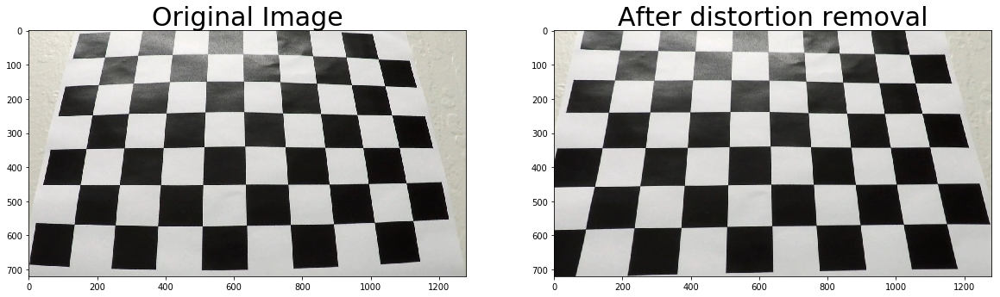

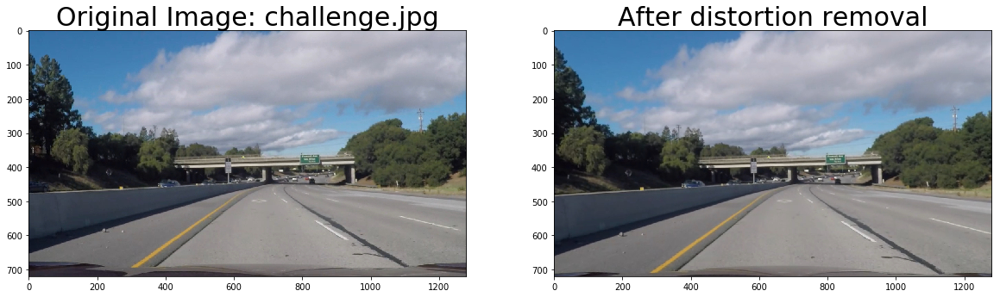

#### 2. Describe how (and identify where in your code) you used color transforms, gradients or other methods to create a thresholded binary image.  Provide an example of a binary image result.

I tried using the various sobel operator methods but I couldn't find them to be more useful than
just using color transforms. I however think they might come in more handy for the more difficult videos.
My pipeline separately finds yellow and white lanes using which I then create the binary image.
 I apply some gaussian blur to reduce the noise in the image and then I convert to the HSV colorspace
for finding the yellow markers. For the white markers I just use RGB thresholds.

| Yellow    | Lower | Higher|
|:----------|:-----:|:-----:|
| Hue       |  15   |   25  |
| Saturation|  90   |   255 |
| Value     |  0    |   255 |

| White    | Lower | Higher|
|:----------|:-----:|:-----:|
| Red       |  200   |   255|
| Green     |  200   |   255|
| Blue      |  200   |   255|

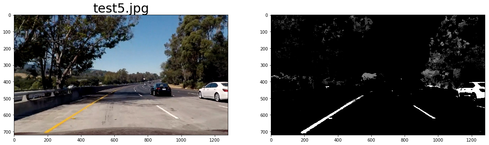

#### 3. Describe how (and identify where in your code) you performed a perspective transform and provide an example of a transformed image.

I chose a test image which has straight lane lines and selected source points on it along the sides of a lane
in the region of interest.I then chose appropriate destination points so that I have a birds eye from
just beyond the car bonnet to a reasonable distance ahead.

I plotted histogram charts for the transformed images to verify that the lane lines looked parallel are the
transform and that the lane width was nearly uniform across all images.

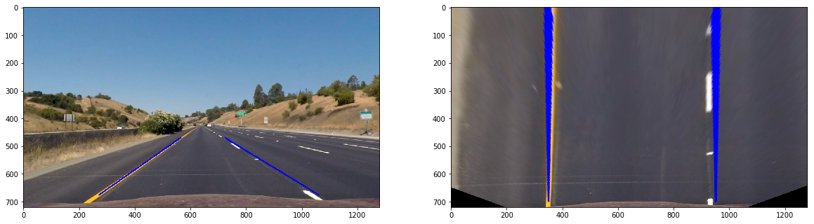

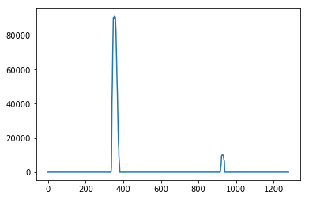

#### 4. Describe how (and identify where in your code) you identified lane-line pixels and fit their positions with a polynomial?
An image undergoes distortion correction, then it is warped to a birds eye view and then
passed through a pipeline to get a binary image.

This binary_image is then used to find the lane lines.
I use the sliding window method to initially find the first set of lane curves.
I begin searching by first checking for the left most lane line which I assume to be to the left of the
midpoint of the image. I then search about 900 pixels to the right to find the right lane.From the histogram we
can see that the lane width is approximately 600 pixels.

Once I have the initial points to start the lane search I then use the sliding window technique to get a
set of points for the left and right lane. Using which I get the second order polynomial curve.
I then continue searching the next set of lane lines to be around the last known left and right lane locations.

Using this same data,I first draw a polygon on a blank image for the birds eye view image .I  then use the Minv matrix to un-warp the birds eye view to the original form.This is then added to the distorion removed image to get the final image we see on the video.

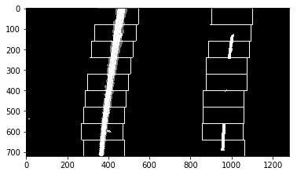

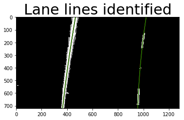

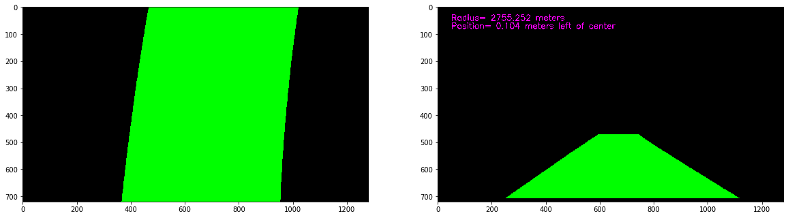

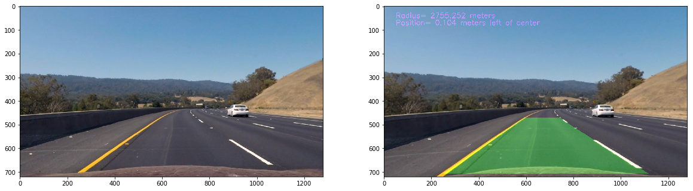

#### 5. Describe how (and identify where in your code) you calculated the radius of curvature of the lane and the position of the vehicle with respect to center.

To calculate the radius of curvature I assume the curve to be a circle and then find its equation.
I first convert the polynomial coefficients from the pixel space to values in meters.

The lane width is 600 pixels which is equivalent of 3.7m.
The lane line length is 140 pixels which is equivalent to 3m

I calculate a new set of polynomial for the left and right lanes in the meter space .
I then find the mid point of the lane at 3 positions.The top of the frame,the middle and the bottom of the
frame.

In general, the x-value for the center of the circle passing through 3 points A (x1, y1), B (x2, y2), C (x3, y3), joined by lines with slopes m1 and m2 is given by:

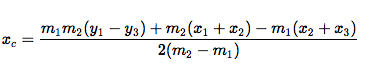

I then find the y co-ordinates from this formula.
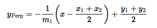

I finally find the radius by calculating the distance between the center and one of the 3 points.

#### 6. Provide an example image of your result plotted back down onto the road such that the lane area is identified clearly.

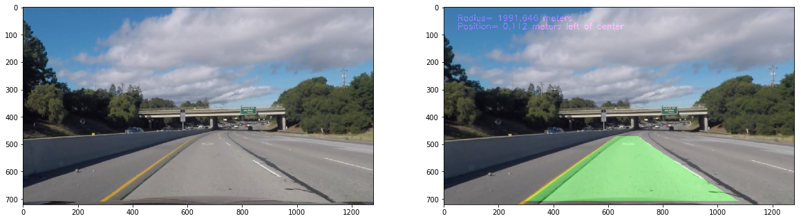

---

### Pipeline (video)

#### 1. Provide a link to your final video output.  Your pipeline should perform reasonably well on the entire project video (wobbly lines are ok but no catastrophic failures that would cause the car to drive off the road!).

Here's a [link to my video result](./output_project_video.mp4)

---

### Discussion

#### 1. Briefly discuss any problems / issues you faced in your implementation of this project.  Where will your pipeline likely fail?  What could you do to make it more robust?

- The lane finding implementation fails to work on the challenge videos.
- I think a more robust lane finding pipeline which includes sobel/canny edge detection is required.
- The inital lane finding can be made robust so that it is aware of the number of lanes and the current lane we are at.
- It doesn't switch back to sliding window technique in case we lose track
- The lane detection would likely fail at very sharp turns where a few frames dont have clear lane markers or if there is a vehicle that obstructs the markings.
