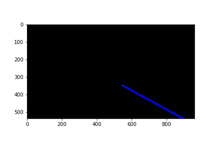

# **Finding Lane Lines on the Road**

## Goal

* Identify lane markings in the given images and draw line segments to annotate them
* Identify and annotate lane markings on videos

## Important considerations for creating pipeline
* Image or video frame size
* Color on the lane markings .
* Color of the road.
* Shadows in the image
* Identifying the correct edges
* Extrapolating line segments

## Assumptions
* Frame size is set to 960 x 540.
* Lane marking lines reach up to a fixed height 190 pixels on the video.
* Car is in the center of the lane.

## Pipeline details

* I first read the image and then resize it to the standard frame size of 960 x 540 using the cv2.resize() function.
* To identify colors in an image I create a mask(a binary image) for that color and then do a "bitwise and" operation with the original image to get the image I want.
* I used the cv2.inRange() function for creating the mask.
* To identify yellow, I convert the image to HSV[1](http://infohost.nmt.edu/tcc/help/pubs/colortheory/web/hsv.html).For identifying yellow, I use a lower threshold of 15 and an upper threshold of 25 for the Hue channel.
* For Saturation and Value channel I had to do a bit of trial and error and see what values gave the best results.
* To identify white I used grayscale and not HSV. I converted the image to grayscale, which is single channel and set a lower threshold of 220 and an upper threshold of 255(max value).This method is a much more accurate way to capture white.
* After applying the mask on the original images.I then apply Gaussian blur to smoothen the images and reduce sharp noise.
* I then create masks using the threshold values which when applied to the original images give resulting images that can be further processed.

The original image:

Mask for yellow:

Mask for white:

After applying mask for yellow:

After applying mask for white:

* The next step is to find edges in the images for the resulting yellow and white images.
I used a threshold of 0,255.Changing it didn't affect my output image.

Canny images with different threshold values:

* I then select a region of interest from these resulting images.The region of interest is a trapezium as shown below

Region of interest:

* The final part of the pipeline which is drawing the lane idenitfying lines.I use a modified hough_lines function that also takes in an parameter for color of the lane lines.I use this to differentiate between Yellow and White markers in the final output.

* The hough line function takes in the output of the Canny transform and returns an black image with the full sized lane lines drawn on it.
I combine the 3 images using the given weighted_img() function to get the final image. The 3 images are:
	* the original image
	* hough_lines output for  yellow lane markers
	* hough_lines output for  white lane markers

* In the heart of it ,it uses the numpy polyfit()[2](https://docs.scipy.org/doc/numpy-1.10.0/reference/generated/numpy.polyfit.html) function with the degree set to 1 since we are looking for single degree polynomials(a line).The function returns a vector of coefficients that minimises the squared error.

* It takes two arrays as input, x and y and will return an output with the m and c ,where
y = mx+c is the equation of the line that best fits the data.

* The input arrays x and y are nothing but the output from the cv2.HoughLinesP() function that returns an array of (x,y) co-ordinates of the the lines present in the input image.The input image in this case is the Canny transform image.

* I differentiate between the left and right lane markings using the X-coordinate.Anything with an X value < 500 (center of region of interest) is considered for creating the left lane marker and the rest for the right lane marker.I then calcualte m and c for each of the left and right lane marker.

* Finally, to draw the full line segment I choose the y values and then calculate the x values .
y=350( top of the region of the interest), y=540(bottom of the frame)

* With the new x and y values, I use drawlines() to create the line on a black image.

| White Lane marker             |   Yellow Lane marker |
:-----------------------------:|:------------------------------:
|Segmented: | |
|       |   |
| Extended: | |
|  |  |

The resulting image is returned to the calling function.

## Reflection
* It is difficult to accurately identify lane markings of two different colors at the same time.Therfore, I identify yellow and white lane markings separately and then superimpose them at the end.
* I used the cv2.inRange () because It works on both, three and single channel images.It takes in the image,the lower and higher threshold values as input and outputs an image that contains values in between the two thresholds.
* The advantage of using HSV for identifying colors is that each color has a narrow Hue value range. The saturation and Value channels don't determine the basic color.
* To identify white I used grayscale and not HSV. I found that by using HSV there is a lot of noise generated if there are other ligher colors such as Gray.This is because whiteness is not controlled by the Hue Channel but instead by the 3rd channel,Value.
* For some reason, changing the canny thresholds didnt effect the output of my images and hence I used a threshold of 0,255.
* I decided in the favor of drawing a single line segment that is the best fit for the data that I have rather than multiple smaller lines.
* The major difficulty I faced was to ensure that the houghlinesP() function is able to return sufficient number of points for me to draw an accurate line.
* I had to use low values for rho, min_line_length  and max_line_gap to be able to get enough points.
* I was comfortable doing this because I had more or less removed most of the noise and unwanted data from the image by carefully selecting the color masks.

## Improvements and further research

* Study why changings canny thresholds don't cause much change in this case.
* Research on HoughP functions parameters
* Identify individual lanes automatically rather than relying on the assupmtion that the car stays in the middle of the lane.The code currently differentiates based on the the x-co-ordiniates being on the left or right of the middle of the region of interest.
* Test in more weather and lighting conditions.

##  Reading material

* [HSV Color Moel](http://infohost.nmt.edu/tcc/help/pubs/colortheory/web/hsv.html)

* [Polyfit funcion](https://docs.scipy.org/doc/numpy-1.10.0/reference/generated/numpy.polyfit.html)

* [Resize function](https://docs.opencv.org/2.4/modules/imgproc/doc/geometric_transformations.html#void%20resize(InputArray%20src,%20OutputArray%20dst,%20Size%20dsize,%20double%20fx,%20double%20fy,%20int%20interpolation))
* [Bitwise AND](https://docs.opencv.org/2.4/modules/core/doc/operations_on_arrays.html?highlight=bitwise_and#cv2.bitwise_and)

* [Hough Lines](https://docs.opencv.org/2.4/modules/imgproc/doc/feature_detection.html?highlight=houghlinesp#houghlinesp)

* [Changing Colorspaces](http://opencv-python-tutroals.readthedocs.io/en/latest/py_tutorials/py_imgproc/py_colorspaces/py_colorspaces.html)

* [RGB to HSV color conversion](http://www.rapidtables.com/convert/color/rgb-to-hsv.htm)

NOTE: For HSV, Hue range is [0,179], Saturation range is [0,255] and Value range is [0,255]. Different softwares use different scales. So if you are comparing OpenCV values with them, you need to normalize these ranges.

* [Blog:A Little About Color: HSV vs. RGB](https://www.kirupa.com/design/little_about_color_hsv_rgb.htm)

* [ColorSpaces](http://www.learnopencv.com/color-spaces-in-opencv-cpp-python/)
