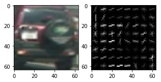
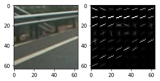
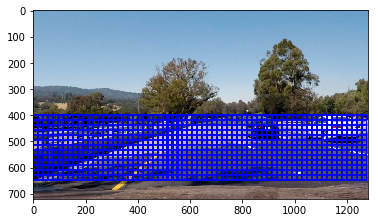
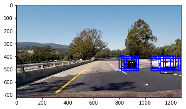
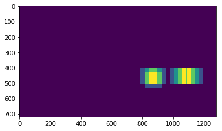
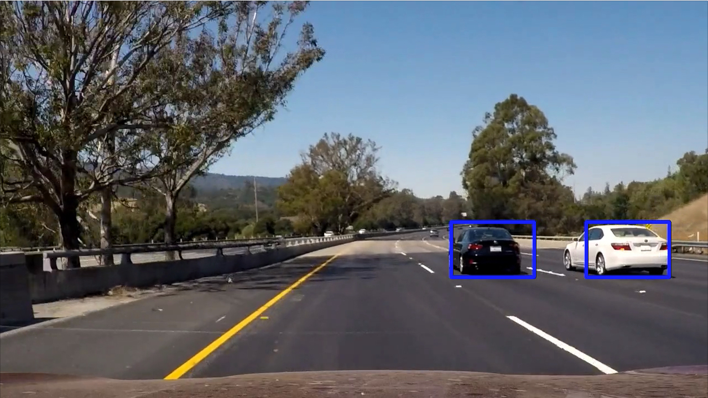

# Vehicle Detection

The goals / steps of this project are the following:

* Perform a Histogram of Oriented Gradients (HOG) feature extraction on a labeled training set of images and train a classifier Linear SVM classifier
* Optionally, you can also apply a color transform and append binned color features, as well as histograms of color, to your HOG feature vector. 
* Note: for those first two steps don't forget to normalize your features and randomize a selection for training and testing.
* Implement a sliding-window technique and use your trained classifier to search for vehicles in images.
* Run your pipeline on a video stream (start with the test_video.mp4 and later implement on full project_video.mp4) and create a heat map of recurring detections frame by frame to reject outliers and follow detected vehicles.
* Estimate a bounding box for vehicles detected.

## [Rubric](https://review.udacity.com/#!/rubrics/513/view) Points
### Here I will consider the rubric points individually and describe how I addressed each point in my implementation.  

### Histogram of Oriented Gradients (HOG)

#### 1. Explain how (and identify where in your code) you extracted HOG features from the training images.

I use the hog function from skimage.feature to extract the hog features.I use 9 orientations ,the maximum value for getting optimum results and the 8 pixels per cell and 2 cells per block in the hog extraction.I extract them for all 3 color channels.

After testing a few variations,the HSV and YCrCb were the best two options that I could find.
In the end I chose YCrCb as that gave me lesser false positives.

#### 2. Explain how you settled on your final choice of HOG parameters.

It was  by running the chosen method on a test image and see which parameters give me the best results.

### Sliding Window Search

#### 1. Describe how (and identify where in your code) you implemented a sliding window search.  How did you decide what scales to search and how much to overlap windows?

To make the pipeline faster,I choose an initial scale of 1.7 to find new cars or for the first time.
After a car has being located,it's position is noted that then I use a range of  scales in the last known area.

The sliding window checks in the y range of 400-650 with an overlap of 0.8. Higher % overlap  is chosen to have a higher chance
to matching a car. Multiple entries for the same are acceptable since later in the pipeline multiple entries are consolidated. 

[]

#### 2. Show some examples of test images to demonstrate how your pipeline is working.  What did you do to optimize the performance of your classifier?

Unoptimized ,initial detection

Optimized pipeline

Heatmap after initial detection

Heatmap after applying threshold 

After applying the label function and drawing the bounding box based on that.

To optimize the pipeline,I dont repeatedly extract the hog features but extract them once and the sub-sample to get for the 
required window.

I also dont scale the whole image multiple times.I only scale areas where a vehicle was previously identified.

### Video Implementation

#### 1. Provide a link to your final video output.  Your pipeline should perform reasonably well on the entire project video (somewhat wobbly or unstable bounding boxes are ok as long as you are identifying the vehicles most of the time with minimal false positives.)
Here's a [link to my video result](./output_project_videoYCrCb.mp4)

#### 2. Describe how (and identify where in your code) you implemented some kind of filter for false positives and some method for combining overlapping bounding boxes.

I use a heatmap to mark pixels that were part of a positive prediction.
I then use scipy.ndimage.measurements.label() to get a uniform structure of the marked pixels.
I have a fixed size of image tracking box which is used at the locations identified by this function.
Also I found that for vehicles that are far away,using the scaled option and cropping the window size by 100 was effective in
better identification of vehicles.

I also update the boxes on the video once every 6 frames so thats the final video output is much smoother.

### Discussion

#### 1. Briefly discuss any problems / issues you faced in your implementation of this project.  Where will your pipeline likely fail?  What could you do to make it more robust?

- The initial search could me made more robust.
- The features vectors could be reduced further.
- The tracking of vehicles present in the frame could be better .Assigning an object instance with  attributes

#### 2. Discussion includes some consideration of problems/issues faced, what could be improved about their algorithm/pipeline, and what hypothetical cases would cause their pipeline to fail.

The major problem I faced was the balance between the scaling factor, overlapping and the threshold to use .I was having a lot of false negatives as I ignored vehicles that were too far. I now use a combination of  scaling factors
More scaling factors  means more processing time and that slows the pipeline down.But having multiple scaling factors 
for a patch helped in ensuring the false positives are below threshold in the heatmap 
